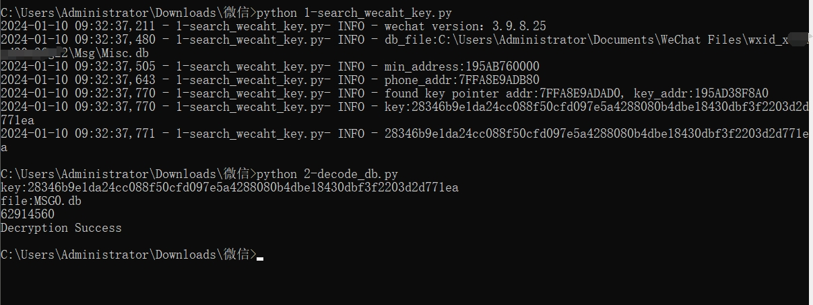
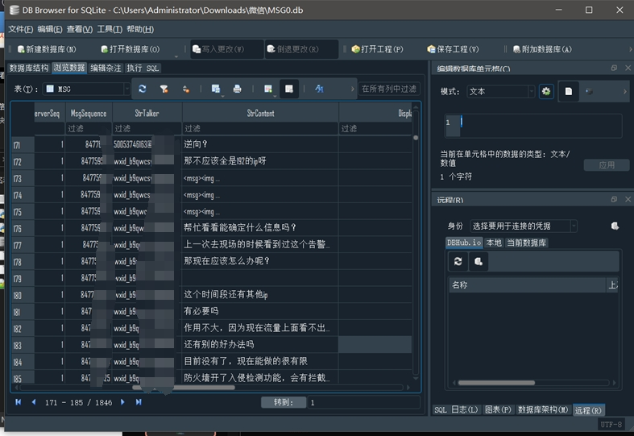

```markdown:README.md
A Python-based tool for decrypting WeChat SQLite databases and extracting message history from memory. This tool uses memory scanning techniques to find encryption keys without needing to update addresses for new WeChat versions.


## Features

- Memory scanning for WeChat encryption keys
- SQLite database decryption
- Extraction of:
  - WeChat ID (wxid)
  - Phone numbers
  - Account information
  - Chat history
- Version-independent address detection
- Automated key extraction from running WeChat instances

## Installation

1. Clone the repository:
```bash
git clone https://github.com/kakachia777/wechat_sqlite.git
cd wechat_sqlite
```

2. Install required dependencies:
```bash
pip install -r requirements.txt
```

## Usage

### Step 1: Extract Key from Running WeChat

Option 1 - Using Python script:
```bash
python 1-search_wechat_key.py
```

Option 2 - Using executable:
```bash
wechat-dump-rs.exe
```

### Step 2: Decrypt Database

1. Copy your MSG0.db to the current directory
2. Run the decryption script:
```bash
python 2-decode_db.py
```

## Requirements

- Python 3.x
- Running WeChat instance
- Windows operating system
- Required Python packages (see requirements.txt)

## Project Structure

```
wechat_sqlite/
├── 1-search_wechat_key.py    # Key extraction script
├── 2-decode_db.py            # Database decryption script
├── wechat-dump-rs.exe        # Standalone key extractor
└── requirements.txt          # Python dependencies
```

## Technical Details

This tool works by:
- Scanning WeChat process memory
- Locating encryption keys using signature patterns
- Extracting base addresses and offsets
- Decrypting SQLite database content

## Examples

This tool is for educational and research purposes only. Use it only on your own WeChat account and data.




